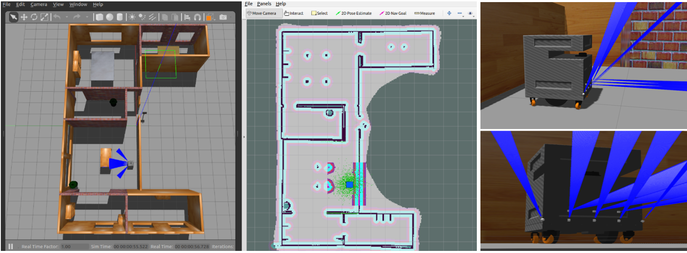
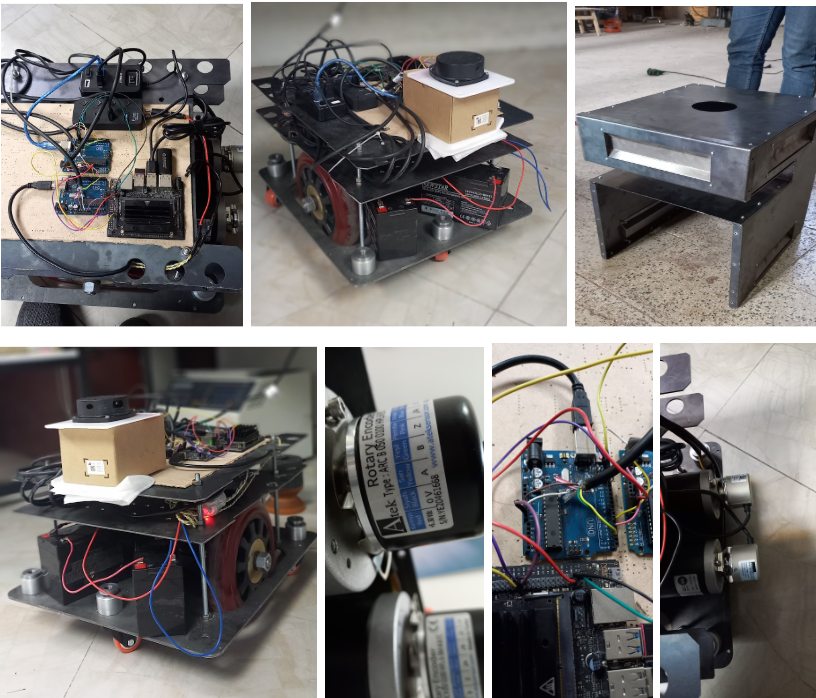
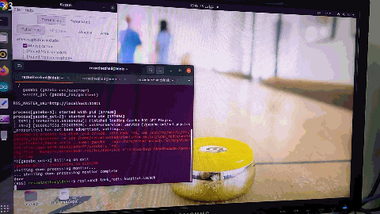
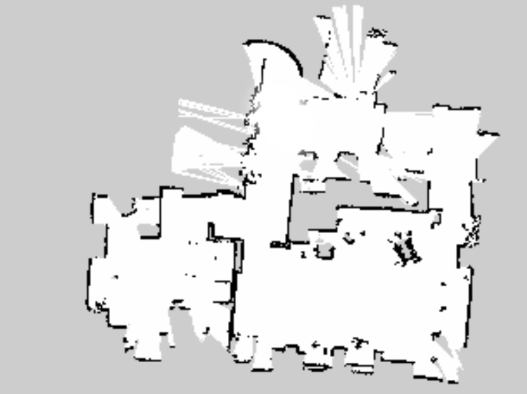
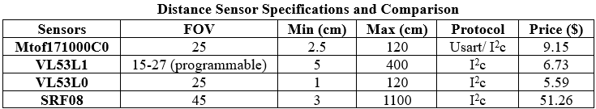
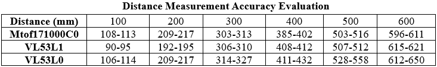
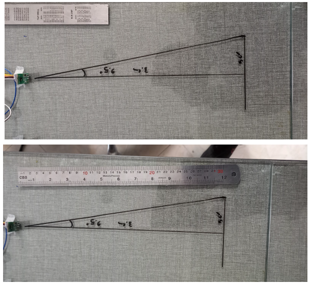
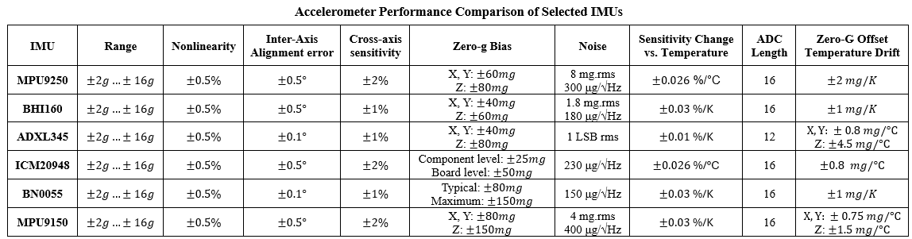
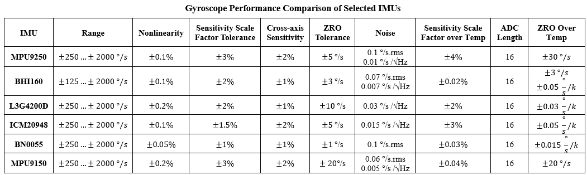

# 🚀 Autonomous Mobile Robot with ROS (SLAM & Navigation)

## 🧠 Overview

This project presents the design and implementation of an autonomous mobile robot using ROS (Robot Operating System). The system integrates SLAM, localization, navigation, and multi-sensor fusion to enable autonomous movement in real-world environments.

The robot is built using a combination of embedded systems (Jetson Nano + Arduino), LIDAR-based perception, and additional sensors such as IMU and ultrasonic modules.

The project includes:
- SLAM-based mapping (GMapping, Hector SLAM)
- Localization using AMCL
- Path planning using ROS Navigation Stack
- Sensor fusion (Encoder + IMU + LIDAR)
- Real-world deployment and testing
- Simulation in Gazebo and visualization in RViz

<table align="left">
  <tr>
    <td></td>
  </tr>
  <tr>
    <td></td>
  </tr>
</table>
 

## 🔧 System Architecture

The system consists of multiple hardware and software components working together:

### 🔹 Hardware
- Jetson Nano (main processing unit)
- Arduino (low-level control & sensor interface)
- RPLidar A1 (environment perception)
- Wheel encoders (odometry)
- IMU sensor (orientation estimation)
- Ultrasonic / ToF sensors (obstacle detection)

### 🔹 Software
- ROS Noetic (Ubuntu 20.04)
- SLAM algorithms (GMapping, Hector SLAM)
- Navigation stack (move_base)
- Sensor drivers and custom ROS nodes

The robot uses a distributed architecture where:
- Arduino handles low-level sensor acquisition
- Jetson Nano processes data and runs ROS
- Communication is done via Serial / I2C

## 🧩 Features

- Autonomous navigation in unknown environments
- Real-time mapping using SLAM
- Accurate localization using AMCL
- Dynamic obstacle avoidance
- Multi-sensor fusion for improved accuracy
- Simulation support (Gazebo)
- Visualization (RViz)

## Results

The robot was tested in both simulation and real-world environments.

Key achievements:
- Successful map generation using LIDAR
- Stable localization using AMCL
- Smooth navigation using DWA local planner
- Integration of additional sensors into costmap

<table align="left">
  <tr>
    <td></td>
    <td></td>
    <td></td>
  </tr>
</table>
 

## 🗺️ Environment Map

The map of the laboratory environment was generated using the implemented SLAM framework. By teleoperating the robot throughout the workspace, a consistent representation of the environment—including walls and obstacles—was constructed.
This map serves as the foundation for localization and autonomous navigation. The integration of sensor data (including odometry and IMU) improves the consistency and reliability of the generated map.

  

## 🧭 Sensor Selection and Evaluation

In this section, multiple distance sensors were evaluated to determine the most suitable option for robotic navigation and obstacle detection. The considered sensors include VL53L1X, VL53L0X, Mtof171000C0, and SRF08. A comparative analysis was conducted based on key characteristics such as field of view (FOV), measurement range, communication protocol, cost, and ease of integration. Additionally, a practical evaluation was performed by measuring sensor outputs at known distances ranging from 10 cm to 60 cm. The measured values were recorded and compared against ground-truth distances to assess accuracy and consistency.

  
  

## 📌 Final Sensor Configuration Decision

Based on accuracy, stability, and integration capability, the VL53L1X sensor was selected as the primary ranging sensor due to its superior accuracy and programmable I2C configuration. To enhance robustness, an additional ultrasonic sensor (SRF08) was incorporated for redundancy in cases where laser-based measurements may fail (e.g., transparent surfaces such as glass).

  

## 🧠 IMU Selection and Sensor Characterization

In mobile robotics, relying solely on wheel encoder data for localization can lead to significant errors, particularly in scenarios involving wheel slippage. To address this limitation, inertial measurements were incorporated to improve robustness and accuracy through sensor fusion. A detailed evaluation of multiple IMU sensors was conducted based on their datasheet specifications, including accelerometer, gyroscope, and magnetometer characteristics.

### 📊 Accelerometer Analysis

Key parameters considered for accelerometer evaluation include:Measurement range (±2g to ±16g), Nonlinearity, Inter-axis alignment error, Cross-axis sensitivity, Zero-g bias and temperature drift, Output noise characteristics, Sensitivity variation with temperature, and ADC resolution. These parameters directly affect the accuracy and stability of motion estimation, particularly in dynamic environments.

  

### 📊 Gyroscope Analysis

For the gyroscope, the following characteristics were analyzed: Full-scale range (±250 to ±2000 °/s), Sensitivity scale factor and tolerance, Nonlinearity, Zero-rate offset (ZRO) and its temperature drift, Output noise and bias stability, Cross-axis sensitivity, and Temperature-dependent variations. These factors determine the reliability of angular velocity estimation and long-term drift behavior.

  

### 🧲 Magnetometer Considerations

Magnetometer data is essential for orientation estimation (yaw angle), but it is highly sensitive to environmental disturbances. To obtain accurate measurements, calibration is required to compensate for: **Hard-iron** distortion (constant offset) and **Soft-iron** distortion (shape deformation of the magnetic field). Calibration was performed by rotating the sensor across all axes, ensuring proper field mapping.

### ⚙️ System Integration

Sensor data is acquired using an Arduino microcontroller via the I2C protocol and transmitted to the Jetson platform through serial communication. A common ground connection between the Arduino and Jetson is required to ensure stable communication and prevent data loss or sensor timeouts. Initially, onboard libraries were used to directly compute orientation (roll, pitch, yaw). However, these methods rely heavily on magnetometer data, which can introduce errors if not properly calibrated.

### 🎯 Final IMU Selection

Based on the comparative analysis, the MPU9250 was selected as the primary IMU sensor due to its balanced performance in terms of accuracy, noise characteristics, and integration capability. By fusing IMU data with wheel encoder measurements, the system significantly improves localization accuracy, particularly in challenging conditions such as wheel slippage.

## ✅ Implemented Features

- SLAM-based mapping using IMU and encoder fusion
- real-time obstacle detection
- Waypoint-based mission execution
- IMU–encoder sensor fusion for improved odometry
- Improved DWA navigation (handling reverse motion issues)
- Integration of auxiliary sensors for obstacle detection
- LiDAR-based pose correction in addition to odometry
- Full simulation in ROS and Gazebo

## 🔮 Future Work

Several improvements are planned to enhance autonomy, safety, and robustness:

- Emergency stop button for manual override
- Human detection and safety shutdown system
- Improved navigation in low-feature environments (corridors and large-scale spaces)
- Autonomous docking and charging system
- ROS-based user interface for mission control
- Integration of depth cameras (e.g., RealSense)
- Definition of restricted zones in the map
- Runtime parameter tuning capability
- Fully autonomous coverage path planning
- Battery monitoring and alert system
- Monitoring of fluid level, flow rate, and concentration
- Visual and auditory status indicators
- Network reliability improvements
- Mechanical redesign and improved sensor placement
- IMU placement optimization near the center of mass
- Fault detection and automatic reset for sensors/modules
- Navigation improvements in dynamic and crowded environments
- Full integration of analog and digital subsystems
- Integration of disinfection subsystem with robot platform
- Advanced collision detection and intelligent stopping behavior

## 🎯 Conclusion

This project demonstrates a complete autonomous robotic system that integrates perception, localization, and navigation into a unified framework. By combining LiDAR-based SLAM with IMU and encoder fusion, the system improves robustness compared to traditional odometry-based approaches. The work also addresses practical engineering challenges such as sensor calibration, multi-device communication, and system integration under real-world constraints. Overall, the system shows a strong foundation for autonomous indoor robotics, with clear pathways for future improvements toward fully deployable real-world applications.

